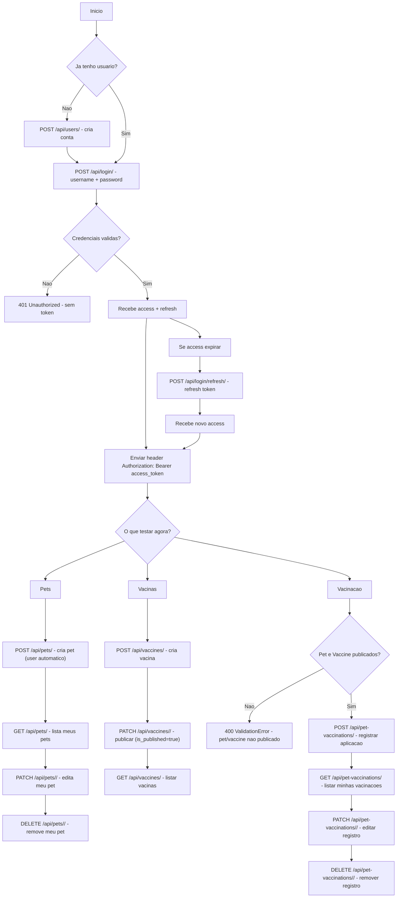

# Desafio IVARE — API Django #

API backend desenvolvida em Django + Django REST Framework, utilizando boas práticas de engenharia de software, isolamento de ambiente, configuração por variáveis de ambiente e banco de dados MySQL em container.

## Desenvolvido por Rafael Évora — @evoradev ##

Clínicas veterinárias precisam de um sistema para acompanhar o histórico de vacinação de pets, permitindo o cadastro de animais, vacinas e registros de aplicação.

Objetivo do Projeto
Construir uma API robusta e escalável para gerenciamento de dados relacionados a pets e vacinas, com foco em:
Padronização de ambiente entre desenvolvedores, Segurança de credenciais via variáveis de ambiente, Arquitetura modular com apps independentes, Preparação para deploy em produção.

## CRIAÇÃO DO APP - DECISÕES ARQUITETURAIS ##

Tecnologias Utilizadas

## Tecnologias

- Python
- Django
- Django REST Framework
- SimpleJWT
- MySQL
- Docker
- git & github

## Gerenciamento de Dependências

Todas as dependências do projeto são controladas via:
pip freeze > requirements.txt
Isso garante que qualquer desenvolvedor consiga reproduzir exatamente o mesmo ambiente.

Estrutura do Projeto
Desafio IVARE/
├── core/              # Configurações principais do projeto
├── pet/               # App responsável pelo domínio de pets e users
├── vaccine/           # App responsável pelo domínio de vacinas
├── manage.py
├── requirements.txt
├── .env.example
├── .gitignore
└── README.md

Optei por criar pet e vaccine como apps separados para demonstração, mas poderiam ser criados em um unico app que possibilitasse o processo completo, mas para demonstrar o conhecimento em django, optei por utilizar mais de um app. Core serve apenas como configuração geral do projeto e apontamento para as rotar (router) no arquivo url. 

Optei por uma estrutura bem definida: Models, Views, Serializers e Urls. Embora fosse possivel criar um arquivo e separar os models dentro, optei por usar o padrão django para pequenos projetos que é utilizar apenas um model.py, view.py e serializers.py sem arquivos maiores separando as classes, mas, para um projeto grande ou que visa escalabilidade o ideal é criar pastas. Ex.: models/(pet ou petVaccination)/model.py e os dados exclusivos daquela classe. 

Obs.: Projeto Dockerizado. Lembre-se de usar os scripts para criar o banco e depois os scripts para a api, caso contrário, o banco possivelmente não será criado à tempo para a configuração "web" o que causará erros no terminal.

Durante o desenvolvimento utilizei um venv e não o django diretamente por facilidade.

## Testes

### Testes funcionais realizados utilizando:
Insomnia
DBeaver

### Validações confirmadas:
Regras de negócio
Restrições de relacionamento
Autenticação JWT

## Como usar

###Build
Linhas de comando:
docker compose build (instale o banco de dados primeiro)
docker compose exec web python manage.py makemigrations
docker compose exec web python manage.py migrate
docker compose up

# Rotas da API

Usuários

POST /api/users/
GET /api/users/me/
PATCH /api/users/me/

Pets

GET /api/pets/
POST /api/pets/
GET /api/pets/{id}/
PATCH /api/pets/{id}/
DELETE /api/pets/{id}/

Vacinas

GET /api/vaccines/
POST /api/vaccines/
GET /api/vaccines/{id}/
PATCH /api/vaccines/{id}/
DELETE /api/vaccines/{id}/

Vacinação

GET /api/pet-vaccinations/
POST /api/pet-vaccinations/
GET /api/pet-vaccinations/{id}/
PATCH /api/pet-vaccinations/{id}/
DELETE /api/pet-vaccinations/{id}/

#### Obs.: Deixei o relacionamento no banco de dados de User com Pet como se User fosse o usuario do sistema fiz dessa forma para demonstrar o conhecimento na parte de Foreigner Key e Autenticação JWT. No banco podemos buscar animais por owner_name ou todos animais cadastrados de um user (usuario do sistema).

# CRIAÇÃO DO APP - ETAPAS DO DESENVOLVIMENTO 

Etapas Realizadas no Projeto
### Criação do ambiente virtual (venv)

Foi criado um ambiente virtual Python para:

Isolar dependências do sistema operacional

Garantir compatibilidade entre máquinas

Evitar conflitos de versões

Comandos:

python -m venv venv
venv\Scripts\activate

### Instalação do Django e Django REST Framework

Dentro da venv:

pip install django djangorestframework

Essas bibliotecas são a base do backend e da construção da API REST.

### Criação do projeto Django
django-admin startproject core .

Servidor local:
python manage.py runserver

### Criação dos apps pet e vaccine
python manage.py startapp pet
python manage.py startapp vaccine

Cada app representa um domínio isolado da aplicação.

### Configuração do Django REST Framework

Instalação e registro no settings.py:

INSTALLED_APPS = [
    ...
    'rest_framework',
    'pet',
    'vaccine',
]

Permitindo criação de APIs REST de forma estruturada.

### Versionamento com Git e criação do .gitignore

Inicialização do repositório Git
Primeiro commit
Criação de .gitignore para evitar versionamento de arquivos sensíveis e pesados:

### Migração de SQLite para MySQL com .env

O banco padrão db.sqlite3 foi substituído por MySQL, com configuração via variáveis de ambiente para segurança e portabilidade.
Instalação:
pip install mysqlclient python-dotenv
Arquivo .env (exemplo):

SECRET_KEY=sua_chave_secreta
DEBUG=True

DB_NAME=meubanco
DB_USER=root
DB_PASSWORD=senha123
DB_HOST=db
DB_PORT=3306

MYSQL_ROOT_PASSWORD=root_pass
MYSQL_DATABASE=dev_db
MYSQL_USER=app_user
MYSQL_PASSWORD=app_pass

ALLOWED_HOSTS=127.0.0.1,localhost

Configuração no settings.py:

DATABASES = {
    'default': {
        'ENGINE': 'django.db.backends.mysql',
        'NAME': os.getenv("DB_NAME"),
        'USER': os.getenv("DB_USER"),
        'PASSWORD': os.getenv("DB_PASSWORD"),
        'HOST': os.getenv("DB_HOST"),
        'PORT': os.getenv("DB_PORT"),
    }
}

### Dockerização: 
Criação do container docker
Arquivos .dockerignore (ignorar desnecessários para o container), Dockerfile (config geral do docker no projeto) e docker-compose.yml (configuração do container do banco de dados MySQL e web).

É possivel usar os comandos docker para buildar e rodar o projeto.

### Desenvolvimento de endpoints REST para pets, incluindo model, serializer e views, seguindo as boas práticas de desenvolvimento de APIs RESTful. 
Endpoints implementados:

GET /api/pets/ - Listar todos os pets   
POST /api/pets/ - Criar um novo pet
GET /api/pets/{id}/ - Detalhes de um pet específico
PUT /api/pets/{id}/ - Atualizar um pet específico
DELETE /api/pets/{id}/ - Deletar um pet específico

Testes funcinonais executados via Insomnia e DBeaver tudo funcionando corretamente. 
Obs.: Ao conectar ao bando de dados MySQL via DBeaver, use as credenciais definidas no .env para garantir acesso ao banco do container.
**Além disso, a porta definida no docker-compose.yml é 3307 para evitar conflitos com MySQL local, verifique esse ponto para garantir a conexão correta.

### Desenvolvimento de endpoints REST para vacinas, seguindo a mesma estrutura e boas práticas dos endpoints de pets.
Endpoints implementados:
GET /api/vaccines/ - Listar todas as vacinas
POST /api/vaccines/ - Criar uma nova vacina
GET /api/vaccines/{id}/ - Detalhes de uma vacina específica
PUT /api/vaccines/{id}/ - Atualizar uma vacina específica
DELETE /api/vaccines/{id}/ - Deletar uma vacina específica

Testes funcionais realizados via Insomnia e DBeaver, confirmando o correto funcionamento dos endpoints e a persistência dos dados no banco MySQL.

### Desenvolvimento de endpoints REST para vacinação de pets, permitindo associar vacinas a pets e registrar a data da vacinação.
Endpoints implementados:    
POST /api/pet-vaccinations/ - Registrar uma vacinação de pet
GET /api/pet-vaccinations/ - Listar todas as vacinações de pets
GET /api/pet-vaccinations/{id}/ - Detalhes de uma vacinação específica
PUT /api/pet-vaccinations/{id}/ - Atualizar uma vacinação específica
DELETE /api/pet-vaccinations/{id}/ - Deletar uma vacinação específica

OBS.: Para simplificar ainda mais o código e seguir boas práticas, foi implementado ModelViewSet nas Views de Pet, Vaccine e PetVaccination (Esse método é mais moderno e elegante).

### Validação de dados nos serializers para garantir que apenas pets e vacinas publicados possam ser associados em uma vacinação, com mensagens de erro claras para o usuário.
Validate é nativa do serializer e possibilita validar entradas antes de realizar a criação ou atualização de um novo objeto no banco de dados.
No caso do PetVaccinationSerializer, foi implementada uma validação personalizada para verificar se o pet e a vacina associados estão publicados. Se algum deles não estiver publicado, uma mensagem de erro específica é retornada para o usuário, indicando qual campo está causando o problema.

### Testes funcionais para garantir que as validações estão funcionando corretamente e que os endpoints estão respondendo conforme o esperado.
Testes realizados via Insomnia para verificar as respostas dos endpoints e a correta aplicação das validações, garantindo que apenas pets e vacinas publicados possam ser associados em uma vacinação, e que mensagens de erro claras sejam retornadas quando as validações falharem.

### Implementaremos o relacionamento de PETs per User utilizando as ferramentas django que oferece um model completo pronto para isso: 
* from django.contrib.auth.models import User 

Dessa forma não é necessário reinventar o que já foi feito, apenas implementar. 
A funcionalidade será aplicada no app "pet" diretamente.

Modificações aplicadas:
Antes: todos viam tudo, todos criavam para qualquer usuário e API insegura. 
Agora: usuário só vê seus próprios dados, usuário só cria para si mesmo, segurança aplicada corretamente e cumpre requisito de autenticação e autorização.

Obs.: Utilizar metodos especificos e pré-definidos do Python, Django e Rest Framework ou até mesmo de FastAPI (outra lib para criação de API's) dinamiza o processo de desenvolvimento otimizando o tempo.

Endpoints implementados:
POST /api/users/ - Registrar um usuario
GET /api/users/ - Listar todas usuarios
GET /api/users/{id}/ - Detalhes de um usuário especifico
PUT /api/users/{id}/ - Atualizar um usuário específico
DELETE /api/users/{id}/ - Deletar um usuário específica

### Implementação de JWT usando djangorestframework_simplejwt para autenticação.
Atualizações aplicadas para validação do JWT em views e settings.py. Agora temos o novo endpoint:

Método	URL
POST	/users/     (apenas para registro)
GET	    /users/me/ 
PATCH	/users/me/ 

Todas as views já esperam validação o token antes de realizar operações ! 
Dessa forma garantimos menor exposição do id de usuário e maior segurança nas operações da api.

